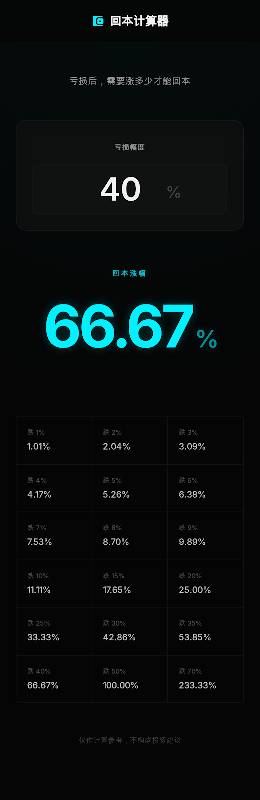

# 回本计算器

一个只做一件事的极简工具项目：输入亏损幅度，立即计算需要上涨多少才能回本。

本仓库不是单一代码目录，而是一个完整的项目交付包，包含：

- 产品定义与测试标准
- UI 设计收敛资料
- 微信小程序实现
- 网页展示版实现
- 项目方法论、工作流与执行手册



## 项目简介

回本计算器聚焦一个高频但容易被做杂的投资场景问题：

> 亏损了 `X%`，还需要上涨多少才能回本？

核心公式：

```text
回本涨幅 = (1 / (1 - 亏损幅度 / 100) - 1) * 100
```

示例：

- 亏损 `40%`，回本涨幅 `66.67%`
- 亏损 `50%`，回本涨幅 `100.00%`
- 亏损 `70%`，回本涨幅 `233.33%`

项目目标不是做一个功能堆叠的金融工具箱，而是做一个：

- 打开即用
- 无广告、无干扰
- 单页面、单功能
- 结果优先、体验克制
- 可复用流程的高质量样板项目

## 当前包含内容

### 1. 微信小程序版

目录：[`huiben-calculator/`](huiben-calculator)

用途：

- 作为正式产品实现基线
- 用于后续继续推进小程序版本

### 2. 网页展示版

目录：[`huiben-calculator-web/`](huiben-calculator-web)

用途：

- 浏览器快速预览
- 对外演示和汇报展示

特点：

- 无需构建
- 可直接打开 `index.html`
- 保持与已验收小程序版本一致的核心逻辑和交互

### 3. 完整项目文档

根目录与 [`product-design/`](product-design) 下保留了完整文档链路，适合后来者快速接手，也适合复盘和复用整套方法。

## 仓库结构

```text
.
├─ README.md
├─ PROJECT_INDEX.md
├─ PROJECT_METHOD_SUMMARY.md
├─ PROJECT_PLAYBOOK.md
├─ PROJECT_WORKFLOW.md
├─ huiben-calculator/
├─ huiben-calculator-web/
└─ product-design/
```

关键目录说明：

- [`huiben-calculator/`](huiben-calculator)：微信小程序实现
- [`huiben-calculator-web/`](huiben-calculator-web)：网页展示版实现
- [`product-design/`](product-design)：PRD、测试用例、开发规则、设计与提示词资料
- [`PROJECT_METHOD_SUMMARY.md`](PROJECT_METHOD_SUMMARY.md)：本项目沉淀出的核心方法论摘要
- [`PROJECT_WORKFLOW.md`](PROJECT_WORKFLOW.md)：从产品定义到测试放行的完整工作流
- [`PROJECT_PLAYBOOK.md`](PROJECT_PLAYBOOK.md)：可直接复用的执行 SOP
- [`PROJECT_INDEX.md`](PROJECT_INDEX.md)：所有关键文档的索引入口

## 功能边界

本项目只做：

- 输入亏损幅度
- 输出回本涨幅
- 展示常用亏损档位速查

明确不做：

- 登录注册
- 历史记录
- 行情数据
- 投资建议
- 多工具集合
- 社区、资讯、分享裂变
- 广告变现

## 交互与规则

- 输入后实时计算，不需要单独点击“计算”按钮
- 支持整数与小数输入
- 最多保留两位小数
- 非法字符自动忽略，并给出轻提示
- 输入 `>= 100` 时显示“无法回本”
- 支持点击速查档位一键带入

## 快速开始

### 网页版预览

方式一：直接打开

打开 [`huiben-calculator-web/index.html`](huiben-calculator-web/index.html) 即可。

方式二：本地静态服务

```bash
python -m http.server 8080
```

然后访问 `http://localhost:8080/huiben-calculator-web/`。

### 微信小程序预览

使用微信开发者工具打开 [`huiben-calculator/`](huiben-calculator) 目录即可预览代码结构与页面实现。

## 核心文档

如果你是第一次接手这个项目，建议按下面顺序阅读：

1. [`PROJECT_METHOD_SUMMARY.md`](PROJECT_METHOD_SUMMARY.md)
2. [`PROJECT_WORKFLOW.md`](PROJECT_WORKFLOW.md)
3. [`PROJECT_PLAYBOOK.md`](PROJECT_PLAYBOOK.md)
4. [`product-design/01-prd.md`](product-design/01-prd.md)
5. [`product-design/02-test-cases.md`](product-design/02-test-cases.md)
6. [`product-design/03-development-rules.md`](product-design/03-development-rules.md)
7. [`PROJECT_INDEX.md`](PROJECT_INDEX.md)

按角色阅读：

- 产品/管理：[`PROJECT_WORKFLOW.md`](PROJECT_WORKFLOW.md)、[`PROJECT_PLAYBOOK.md`](PROJECT_PLAYBOOK.md)
- 开发：[`product-design/01-prd.md`](product-design/01-prd.md)、[`product-design/02-test-cases.md`](product-design/02-test-cases.md)、[`product-design/03-development-rules.md`](product-design/03-development-rules.md)
- 设计：[`product-design/ui-design-prompt/`](product-design/ui-design-prompt)、[`product-design/stitch/`](product-design/stitch)
- 测试：[`product-design/10-web-test-ai-prompt.md`](product-design/10-web-test-ai-prompt.md)、[`huiben-calculator-web/qa/test-report.md`](huiben-calculator-web/qa/test-report.md)

## 项目状态

当前仓库已形成完整闭环：

- 产品定义完成
- 设计收敛完成
- 微信小程序实现完成并验收
- 网页展示版实现完成并验收
- 测试结论为通过，网页版已可视为可上线版本

相关文件：

- 测试报告：[`huiben-calculator-web/qa/test-report.md`](huiben-calculator-web/qa/test-report.md)
- 方法论摘要：[`PROJECT_METHOD_SUMMARY.md`](PROJECT_METHOD_SUMMARY.md)

## 方法论摘要

这个项目真正沉淀下来的，不只是一个“回本计算器”，而是一套适合小功能、高体验要求项目的受控交付方法：

```text
产品定义 -> 规则固化 -> 角色分工 -> 定向执行 -> 独立验收 -> 闭环修正 -> 测试放行 -> 文档沉淀
```

如果你只想快速理解这套方法，直接看：

- [`PROJECT_METHOD_SUMMARY.md`](PROJECT_METHOD_SUMMARY.md)

## 许可与说明

本仓库当前以项目展示、交付归档和方法论复用为主要目的。

页面中的计算结果仅作参考，不构成任何投资建议。
